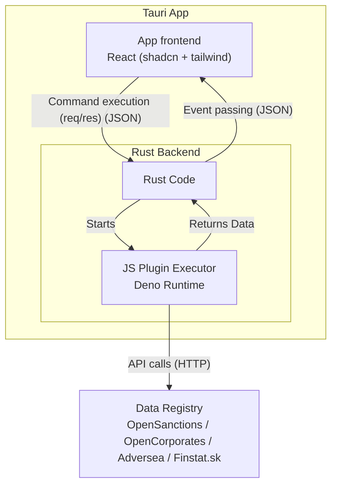

# C4 / Core Architecture (Mermaid)

Source: `docs/C4.drawio`

```mermaid
flowchart TB
  subgraph tauri["Tauri App"]
    direction TB
    frontend["App frontend<br/>React (shadcn + tailwind)"]

    subgraph backend["Rust Backend"]
      direction LR
      rustcode["Rust Code"]
      executor["JS Plugin Executor<br/>Deno Runtime"]
    end
  end

  registry["Data Registry<br/>OpenSanctions / OpenCorporates / Adversea / Finstat.sk"]

  frontend -->|"Command execution (req/res) (JSON)"| rustcode
  rustcode -->|"Event passing (JSON)"| frontend
  rustcode -->|"Starts"| executor
  executor -->|"API calls (HTTP)"| registry
  executor -->|"Returns Data"| rustcode
```
