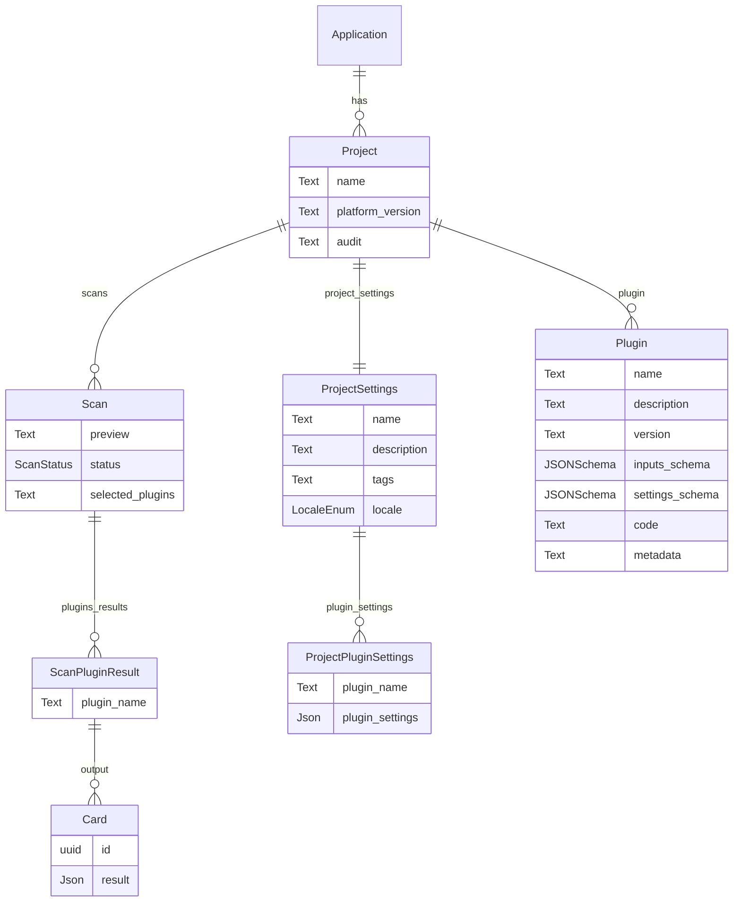

# Entity Diagram (Mermaid)

Source: `docs/Entity.drawio`

```mermaid
erDiagram
  Application ||--o{ Project : has
  Project ||--o{ Scan : scans
  Scan ||--o{ ScanPluginResult : plugins_results
  ScanPluginResult ||--o{ Card : output
  Project ||--|| ProjectSettings : project_settings
  ProjectSettings ||--o{ ProjectPluginSettings : plugin_settings
  Project ||--o{ Plugin : plugin

  Project {
    Text name
    Text platform_version
    Text audit
  }

  Scan {
    Text preview
    ScanStatus status
    Text selected_plugins
  }

  Plugin {
    Text name
    Text description
    Text version
    JSONSchema inputs_schema
    JSONSchema settings_schema
    Text code
    Text metadata
  }

  ProjectPluginSettings {
    Text plugin_name
    Json plugin_settings
  }

  ScanPluginResult {
    Text plugin_name
  }

  ProjectSettings {
    Text name
    Text description
    Text tags
    LocaleEnum locale
  }

  Card {
    uuid id
    Json result
  }
```
